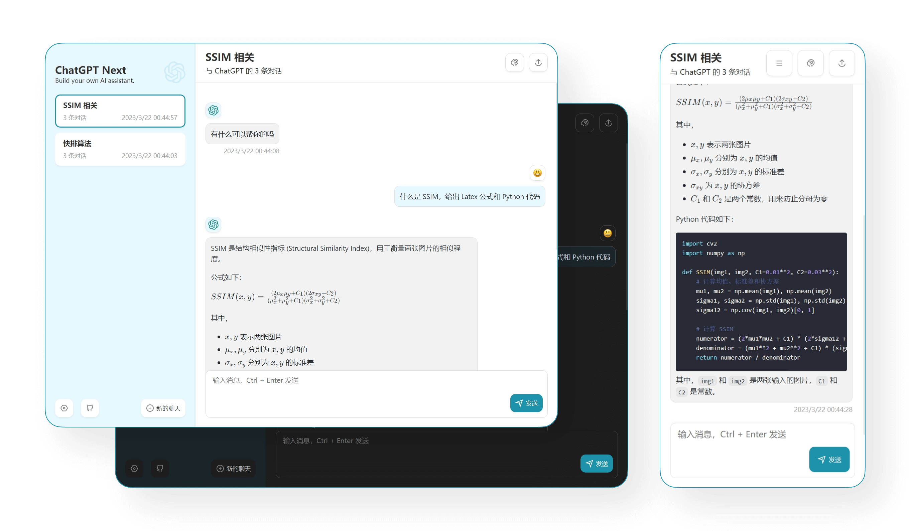
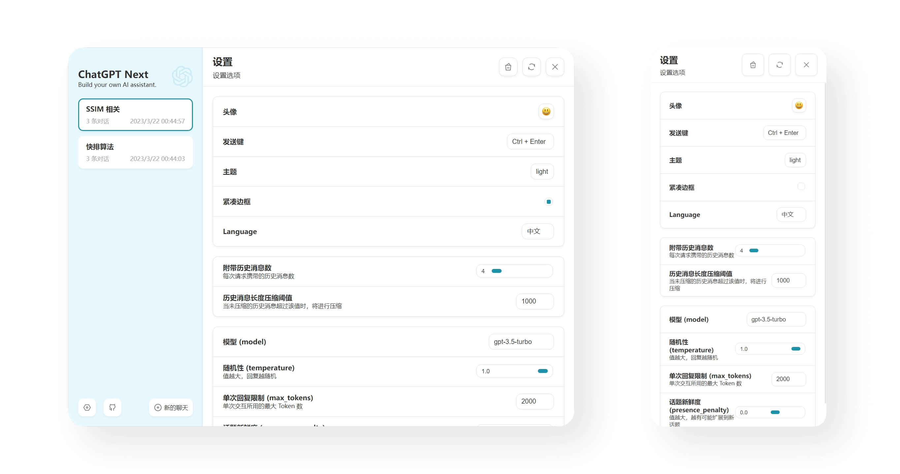
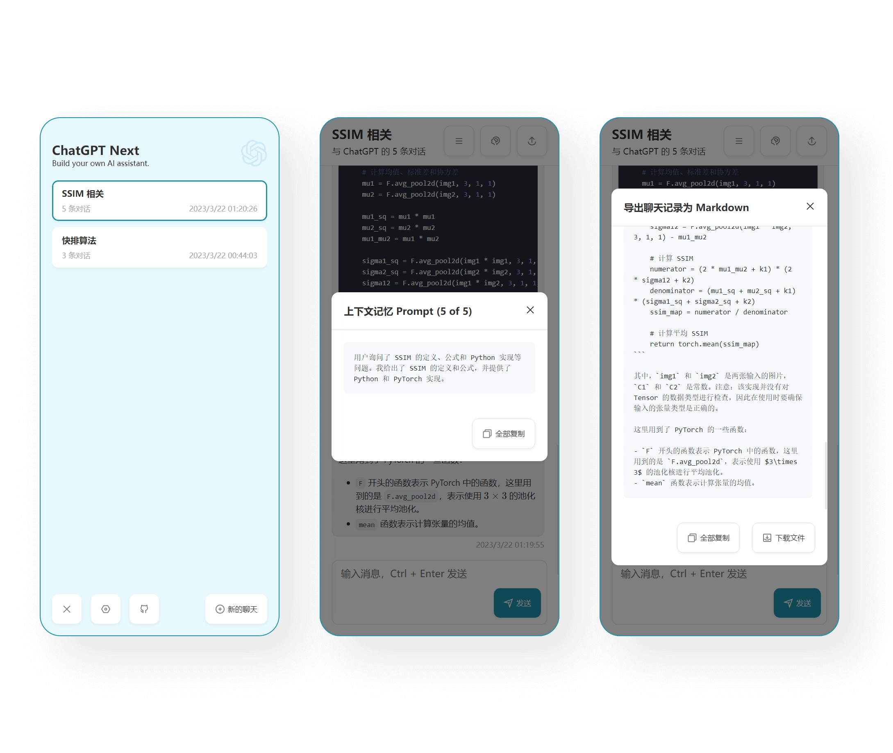

<div align="center">


<h1 align="center">ChatGPT Next Web</h1>

一键免费部署你的私人 ChatGPT 网页应用。

One-Click to deploy your own ChatGPT web UI.

[演示 Demo](https://chat-gpt-next-web.vercel.app/) / [反馈问题 Issues](https://github.com/Yidadaa/ChatGPT-Next-Web/issues)

[](https://vercel.com/new/clone?repository-url=https%3A%2F%2Fgithub.com%2FYidadaa%2FChatGPT-Next-Web&env=OPENAI_API_KEY&project-name=chatgpt-next-web&repository-name=ChatGPT-Next-Web)

[](https://gitpod.io/#https://github.com/Yidadaa/ChatGPT-Next-Web)



</div>

## 主要功能

- 在 1 分钟内使用 Vercel **免费一键部署**
- 精心设计的 UI，响应式设计，支持深色模式
- 极快的首屏加载速度（~85kb）
- 自动压缩上下文聊天记录，在节省 Token 的同时支持超长对话
- 一键导出聊天记录，完整的 Markdown 支持
- 拥有自己的域名？好上加好，绑定后即可在任何地方**无障碍**快速访问

## Features

- **Deploy for free with one-click** on Vercel in under 1 minute
- Responsive design, and dark mode
- Fast first screen loading speed (~85kb)
- Automatically compresses chat history to support long conversations while also saving your tokens
- One-click export all chat history with full Markdown support

## 使用

1. 准备好你的 [OpenAI API Key](https://platform.openai.com/account/api-keys);
2. 点击右侧按钮开始部署：
   [](https://vercel.com/new/clone?repository-url=https%3A%2F%2Fgithub.com%2FYidadaa%2FChatGPT-Next-Web&env=OPENAI_API_KEY&project-name=chatgpt-next-web&repository-name=ChatGPT-Next-Web)，直接使用 Github 账号登陆即可，记得在环境变量页填入 API Key；
3. 部署完毕后，即可开始使用；
4. （可选）[绑定自定义域名](https://vercel.com/docs/concepts/projects/domains/add-a-domain)：Vercel 分配的域名 DNS 在某些区域被污染了，绑定自定义域名即可直连。

## Get Started

1. Get [OpenAI API Key](https://platform.openai.com/account/api-keys);
2. Click
   [](https://vercel.com/new/clone?repository-url=https%3A%2F%2Fgithub.com%2FYidadaa%2FChatGPT-Next-Web&env=OPENAI_API_KEY&project-name=chatgpt-next-web&repository-name=ChatGPT-Next-Web);
3. Enjoy :)

## 保持更新 Keep Updated

本项目会持续更新，如果你想让代码库总是保持更新，可以查看 [Github 的文档](https://docs.github.com/en/pull-requests/collaborating-with-pull-requests/working-with-forks/syncing-a-fork) 了解如何让 fork 的项目与上游代码同步，建议定期进行同步操作以获得新功能。

你可以 star/watch 本项目或者 follow 作者来及时获得新功能更新通知。

This project will be continuously maintained. If you want to keep the code repository up to date, you can check out the [Github documentation](https://docs.github.com/en/pull-requests/collaborating-with-pull-requests/working-with-forks/syncing-a-fork) to learn how to synchronize a forked project with upstream code. It is recommended to perform synchronization operations regularly.

You can star or watch this project or follow author to get release notifictions in time.

## 开发 Development

点击下方按钮，开始二次开发：

[](https://gitpod.io/#https://github.com/Yidadaa/ChatGPT-Next-Web)

在开始写代码之前，需要在项目根目录新建一个 `.env.local` 文件，里面填入环境变量：

Before starting development, you must create a new `.env.local` file at project root, and place your api key into it:

```
OPENAI_API_KEY=<your api key here>
```

## 截图 Screenshots





## LICENSE

- [Anti 996 License](https://github.com/kattgu7/Anti-996-License/blob/master/LICENSE_CN_EN)
