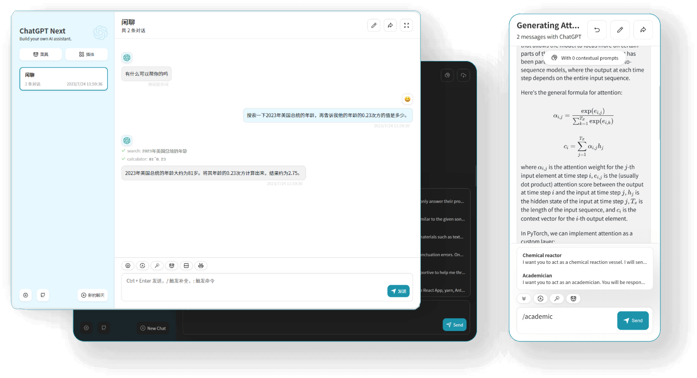
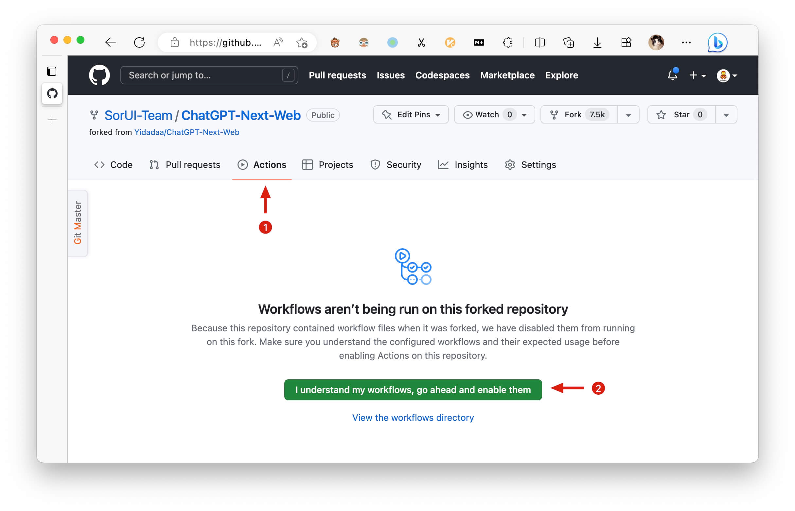
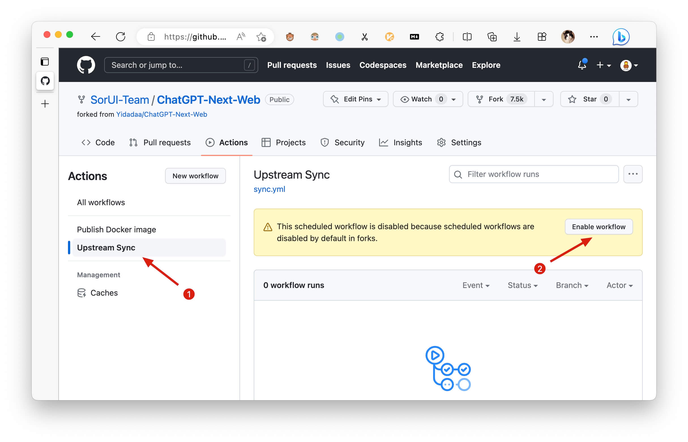
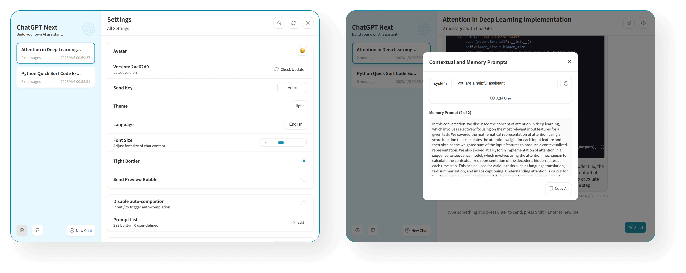
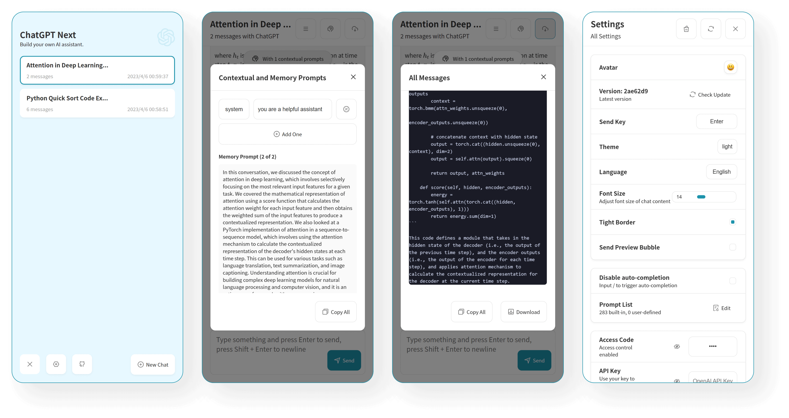

<div align="center">


<h1 align="center">ChatGPT Next Web</h1>

English / [简体中文](./README_CN.md) / [日本語](./README_JA.md)

One-Click to get well-designed cross-platform ChatGPT web UI.

一键免费部署你的跨平台私人 ChatGPT 应用。

[![Web][Web-image]][web-url]
[![Windows][Windows-image]][download-url]
[![MacOS][MacOS-image]][download-url]
[![Linux][Linux-image]][download-url]

[Web App](https://chatgpt.nextweb.fun/) / [Desktop App](https://github.com/Yidadaa/ChatGPT-Next-Web/releases) / [Discord](https://discord.gg/YCkeafCafC) / [Twitter](https://twitter.com/mortiest_ricky) / [Buy Me a Coffee](https://www.buymeacoffee.com/yidadaa)

[网页版](https://chatgpt.nextweb.fun/) / [客户端](https://github.com/Yidadaa/ChatGPT-Next-Web/releases) / [反馈](https://github.com/Yidadaa/ChatGPT-Next-Web/issues) / [QQ 群](https://github.com/Yidadaa/ChatGPT-Next-Web/discussions/1724) / [打赏开发者](https://user-images.githubusercontent.com/16968934/227772541-5bcd52d8-61b7-488c-a203-0330d8006e2b.jpg)

[web-url]: https://chatgpt.nextweb.fun
[download-url]: https://github.com/Yidadaa/ChatGPT-Next-Web/releases
[Web-image]: https://img.shields.io/badge/Web-PWA-orange?logo=microsoftedge
[Windows-image]: https://img.shields.io/badge/-Windows-blue?logo=windows
[MacOS-image]: https://img.shields.io/badge/-MacOS-black?logo=apple
[Linux-image]: https://img.shields.io/badge/-Linux-333?logo=ubuntu

[](https://vercel.com/new/clone?repository-url=https%3A%2F%2Fgithub.com%2FYidadaa%2FChatGPT-Next-Web&env=OPENAI_API_KEY&env=CODE&project-name=chatgpt-next-web&repository-name=ChatGPT-Next-Web)

[](https://gitpod.io/#https://github.com/Yidadaa/ChatGPT-Next-Web)



</div>

## Features

- **Deploy for free with one-click** on Vercel in under 1 minute
- Compact client (~5MB) on Linux/Windows/MacOS, [download it now](https://github.com/Yidadaa/ChatGPT-Next-Web/releases)
- Fully compatible with self-deployed llms, recommended for use with [RWKV-Runner](https://github.com/josStorer/RWKV-Runner) or [LocalAI](https://github.com/go-skynet/LocalAI)
- Privacy first, all data stored locally in the browser
- Markdown support: LaTex, mermaid, code highlight, etc.
- Responsive design, dark mode and PWA
- Fast first screen loading speed (~100kb), support streaming response
- New in v2: create, share and debug your chat tools with prompt templates (mask)
- Awesome prompts powered by [awesome-chatgpt-prompts-zh](https://github.com/PlexPt/awesome-chatgpt-prompts-zh) and [awesome-chatgpt-prompts](https://github.com/f/awesome-chatgpt-prompts)
- Automatically compresses chat history to support long conversations while also saving your tokens
- I18n: English, 简体中文, 繁体中文, 日本語, Français, Español, Italiano, Türkçe, Deutsch, Tiếng Việt, Русский, Čeština, 한국어

## Roadmap

- [x] System Prompt: pin a user defined prompt as system prompt [#138](https://github.com/Yidadaa/ChatGPT-Next-Web/issues/138)
- [x] User Prompt: user can edit and save custom prompts to prompt list
- [x] Prompt Template: create a new chat with pre-defined in-context prompts [#993](https://github.com/Yidadaa/ChatGPT-Next-Web/issues/993)
- [x] Share as image, share to ShareGPT [#1741](https://github.com/Yidadaa/ChatGPT-Next-Web/pull/1741)
- [x] Desktop App with tauri
- [x] Self-host Model: Fully compatible with [RWKV-Runner](https://github.com/josStorer/RWKV-Runner), as well as server deployment of [LocalAI](https://github.com/go-skynet/LocalAI): llama/gpt4all/rwkv/vicuna/koala/gpt4all-j/cerebras/falcon/dolly etc.
- [ ] Plugins: support network search, calculator, any other apis etc. [#165](https://github.com/Yidadaa/ChatGPT-Next-Web/issues/165)

## What's New

- 🚀 v2.0 is released, now you can create prompt templates, turn your ideas into reality! Read this: [ChatGPT Prompt Engineering Tips: Zero, One and Few Shot Prompting](https://www.allabtai.com/prompt-engineering-tips-zero-one-and-few-shot-prompting/).
- 🚀 v2.7 let's share conversations as image, or share to ShareGPT!
- 🚀 v2.8 now we have a client that runs across all platforms!

## 主要功能

- 在 1 分钟内使用 Vercel **免费一键部署**
- 提供体积极小（~5MB）的跨平台客户端（Linux/Windows/MacOS）, [下载地址](https://github.com/Yidadaa/ChatGPT-Next-Web/releases)
- 完整的 Markdown 支持：LaTex 公式、Mermaid 流程图、代码高亮等等
- 精心设计的 UI，响应式设计，支持深色模式，支持 PWA
- 极快的首屏加载速度（~100kb），支持流式响应
- 隐私安全，所有数据保存在用户浏览器本地
- 预制角色功能（面具），方便地创建、分享和调试你的个性化对话
- 海量的内置 prompt 列表，来自[中文](https://github.com/PlexPt/awesome-chatgpt-prompts-zh)和[英文](https://github.com/f/awesome-chatgpt-prompts)
- 自动压缩上下文聊天记录，在节省 Token 的同时支持超长对话
- 多国语言支持：English, 简体中文, 繁体中文, 日本語, Español, Italiano, Türkçe, Deutsch, Tiếng Việt, Русский, Čeština
- 拥有自己的域名？好上加好，绑定后即可在任何地方**无障碍**快速访问

## 开发计划

- [x] 为每个对话设置系统 Prompt [#138](https://github.com/Yidadaa/ChatGPT-Next-Web/issues/138)
- [x] 允许用户自行编辑内置 Prompt 列表
- [x] 预制角色：使用预制角色快速定制新对话 [#993](https://github.com/Yidadaa/ChatGPT-Next-Web/issues/993)
- [x] 分享为图片，分享到 ShareGPT 链接 [#1741](https://github.com/Yidadaa/ChatGPT-Next-Web/pull/1741)
- [x] 使用 tauri 打包桌面应用
- [x] 支持自部署的大语言模型：开箱即用 [RWKV-Runner](https://github.com/josStorer/RWKV-Runner) ，服务端部署 [LocalAI 项目](https://github.com/go-skynet/LocalAI) llama / gpt4all / rwkv / vicuna / koala / gpt4all-j / cerebras / falcon / dolly 等等，或者使用 [api-for-open-llm](https://github.com/xusenlinzy/api-for-open-llm)
- [ ] 插件机制，支持联网搜索、计算器、调用其他平台 api [#165](https://github.com/Yidadaa/ChatGPT-Next-Web/issues/165)

## 最新动态

- 🚀 v2.0 已经发布，现在你可以使用面具功能快速创建预制对话了！ 了解更多： [ChatGPT 提示词高阶技能：零次、一次和少样本提示](https://github.com/Yidadaa/ChatGPT-Next-Web/issues/138)。
- 💡 想要更方便地随时随地使用本项目？可以试下这款桌面插件：https://github.com/mushan0x0/AI0x0.com
- 🚀 v2.7 现在可以将会话分享为图片了，也可以分享到 ShareGPT 的在线链接。
- 🚀 v2.8 发布了横跨 Linux/Windows/MacOS 的体积极小的客户端。

## Get Started

> [简体中文 > 如何开始使用](./README_CN.md#开始使用)

1. Get [OpenAI API Key](https://platform.openai.com/account/api-keys);
2. Click
   [](https://vercel.com/new/clone?repository-url=https%3A%2F%2Fgithub.com%2FYidadaa%2FChatGPT-Next-Web&env=OPENAI_API_KEY&env=CODE&project-name=chatgpt-next-web&repository-name=ChatGPT-Next-Web), remember that `CODE` is your page password;
3. Enjoy :)

## FAQ

[简体中文 > 常见问题](./docs/faq-cn.md)

[English > FAQ](./docs/faq-en.md)

## Keep Updated

> [简体中文 > 如何保持代码更新](./README_CN.md#保持更新)

If you have deployed your own project with just one click following the steps above, you may encounter the issue of "Updates Available" constantly showing up. This is because Vercel will create a new project for you by default instead of forking this project, resulting in the inability to detect updates correctly.

We recommend that you follow the steps below to re-deploy:

- Delete the original repository;
- Use the fork button in the upper right corner of the page to fork this project;
- Choose and deploy in Vercel again, [please see the detailed tutorial](./docs/vercel-cn.md).

### Enable Automatic Updates

> If you encounter a failure of Upstream Sync execution, please manually sync fork once.

After forking the project, due to the limitations imposed by GitHub, you need to manually enable Workflows and Upstream Sync Action on the Actions page of the forked project. Once enabled, automatic updates will be scheduled every hour:





### Manually Updating Code

If you want to update instantly, you can check out the [GitHub documentation](https://docs.github.com/en/pull-requests/collaborating-with-pull-requests/working-with-forks/syncing-a-fork) to learn how to synchronize a forked project with upstream code.

You can star or watch this project or follow author to get release notifications in time.

## Access Password

> [简体中文 > 如何增加访问密码](./README_CN.md#配置页面访问密码)

This project provides limited access control. Please add an environment variable named `CODE` on the vercel environment variables page. The value should be passwords separated by comma like this:

```
code1,code2,code3
```

After adding or modifying this environment variable, please redeploy the project for the changes to take effect.

## Environment Variables

> [简体中文 > 如何配置 api key、访问密码、接口代理](./README_CN.md#环境变量)

### `OPENAI_API_KEY` (required)

Your openai api key.

### `CODE` (optional)

Access passsword, separated by comma.

### `BASE_URL` (optional)

> Default: `https://api.openai.com`

> Examples: `http://your-openai-proxy.com`

Override openai api request base url.

### `OPENAI_ORG_ID` (optional)

Specify OpenAI organization ID.

### `HIDE_USER_API_KEY` (optional)

> Default: Empty

If you do not want users to input their own API key, set this value to 1.

### `DISABLE_GPT4` (optional)

> Default: Empty

If you do not want users to use GPT-4, set this value to 1.

### `HIDE_BALANCE_QUERY` (optional)

> Default: Empty

If you do not want users to query balance, set this value to 1.

## Requirements

NodeJS >= 18, Docker >= 20

## Development

> [简体中文 > 如何进行二次开发](./README_CN.md#开发)

[](https://gitpod.io/#https://github.com/Yidadaa/ChatGPT-Next-Web)

Before starting development, you must create a new `.env.local` file at project root, and place your api key into it:

```
OPENAI_API_KEY=<your api key here>

# if you are not able to access openai service, use this BASE_URL
BASE_URL=https://chatgpt1.nextweb.fun/api/proxy
```

### Local Development

```shell
# 1. install nodejs and yarn first
# 2. config local env vars in `.env.local`
# 3. run
yarn install
yarn dev
```

## Deployment

> [简体中文 > 如何部署到私人服务器](./README_CN.md#部署)

### Docker (Recommended)

```shell
docker pull yidadaa/chatgpt-next-web

docker run -d -p 3000:3000 \
   -e OPENAI_API_KEY=sk-xxxx \
   -e CODE=your-password \
   yidadaa/chatgpt-next-web
```

You can start service behind a proxy:

```shell
docker run -d -p 3000:3000 \
   -e OPENAI_API_KEY=sk-xxxx \
   -e CODE=your-password \
   -e PROXY_URL=http://localhost:7890 \
   yidadaa/chatgpt-next-web
```

If your proxy needs password, use:

```shell
-e PROXY_URL="http://127.0.0.1:7890 user pass"
```

### Shell

```shell
bash <(curl -s https://raw.githubusercontent.com/Yidadaa/ChatGPT-Next-Web/main/scripts/setup.sh)
```

## Screenshots





## Translation

If you want to add a new translation, read this [document](./docs/translation.md).

## Donation

[Buy Me a Coffee](https://www.buymeacoffee.com/yidadaa)

## Special Thanks

### Sponsor

> 仅列出捐赠金额 >= 100RMB 的用户。

[@mushan0x0](https://github.com/mushan0x0)
[@ClarenceDan](https://github.com/ClarenceDan)
[@zhangjia](https://github.com/zhangjia)
[@hoochanlon](https://github.com/hoochanlon)
[@relativequantum](https://github.com/relativequantum)
[@desenmeng](https://github.com/desenmeng)
[@webees](https://github.com/webees)
[@chazzhou](https://github.com/chazzhou)
[@hauy](https://github.com/hauy)
[@Corwin006](https://github.com/Corwin006)
[@yankunsong](https://github.com/yankunsong)
[@ypwhs](https://github.com/ypwhs)
[@fxxxchao](https://github.com/fxxxchao)
[@hotic](https://github.com/hotic)
[@WingCH](https://github.com/WingCH)
[@jtung4](https://github.com/jtung4)
[@micozhu](https://github.com/micozhu)
[@jhansion](https://github.com/jhansion)
[@Sha1rholder](https://github.com/Sha1rholder)
[@AnsonHyq](https://github.com/AnsonHyq)
[@synwith](https://github.com/synwith)
[@piksonGit](https://github.com/piksonGit)

### Contributor

[Contributors](https://github.com/Yidadaa/ChatGPT-Next-Web/graphs/contributors)

## LICENSE

[MIT](https://opensource.org/license/mit/)
