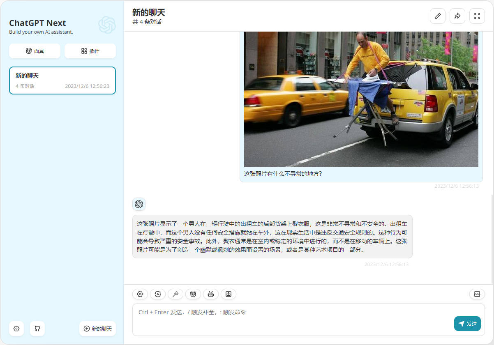
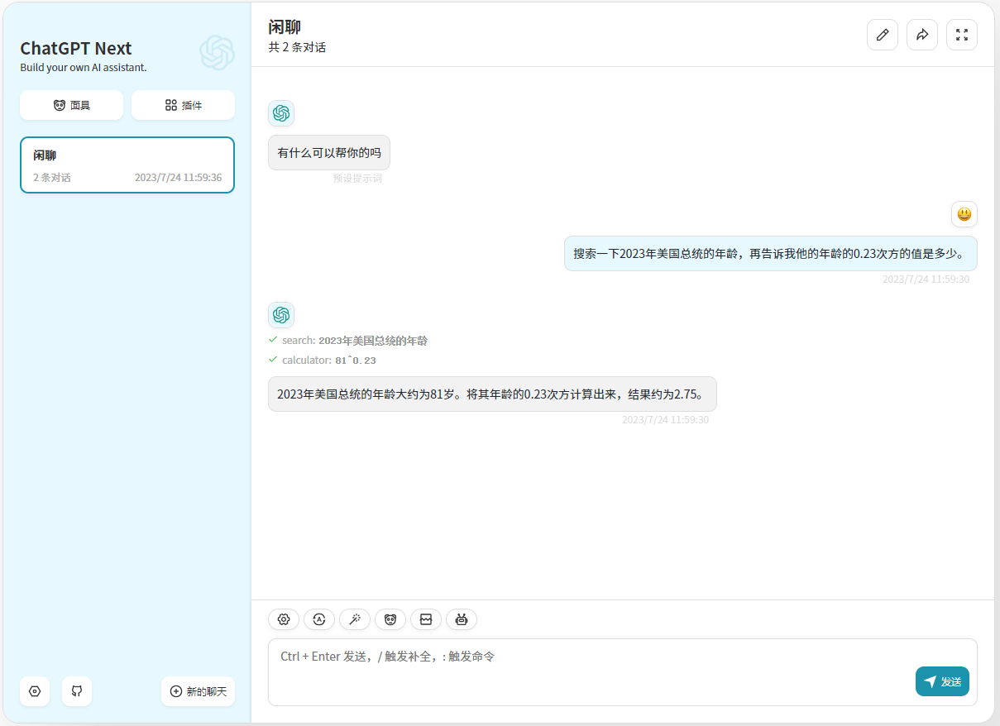
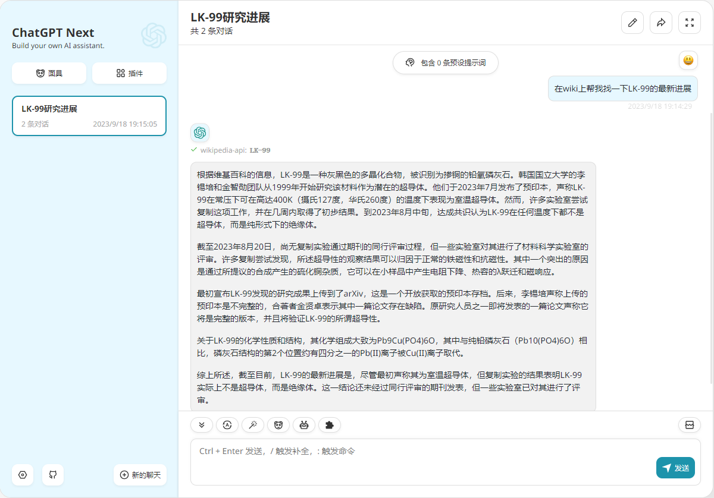
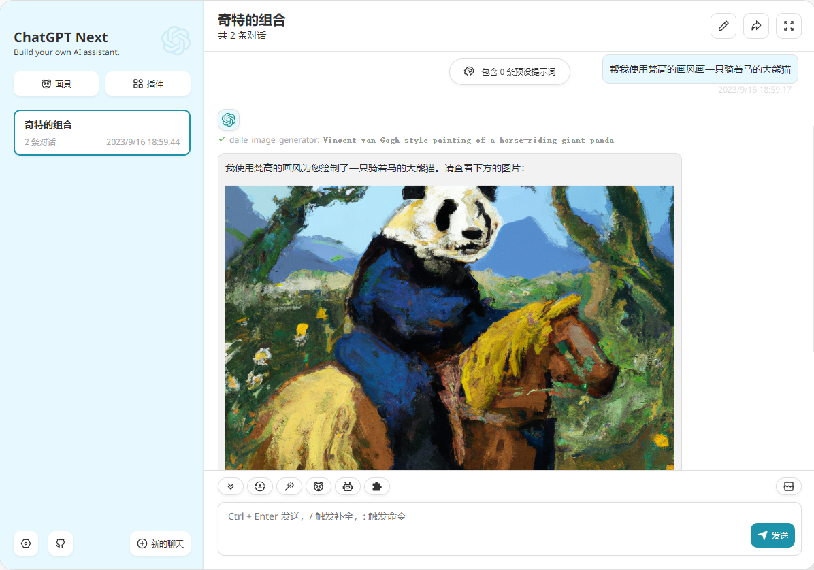

<div align="center">


<h1 align="center">ChatGPT Next Web LangChain</h1>

一键免费部署你的跨平台私人 ChatGPT 应用, 支持 GPT3, GPT4 & Gemini Pro 模型。（基于 LangChain 实现插件功能）

[![Web][Web-image]][web-url]

[网页版](https://chat-gpt-next-web-gosuto.vercel.app/) / [反馈](https://github.com/Hk-Gosuto/ChatGPT-Next-Web-LangChain/issues)

[web-url]: https://chat-gpt-next-web-gosuto.vercel.app/
[download-url]: https://github.com/Hk-Gosuto/ChatGPT-Next-Web-LangChain/releases
[Web-image]: https://img.shields.io/badge/Web-PWA-orange?logo=microsoftedge
[Windows-image]: https://img.shields.io/badge/-Windows-blue?logo=windows
[MacOS-image]: https://img.shields.io/badge/-MacOS-black?logo=apple
[Linux-image]: https://img.shields.io/badge/-Linux-333?logo=ubuntu

[](https://vercel.com/new/clone?repository-url=https%3A%2F%2Fgithub.com%2FHk-Gosuto%2FChatGPT-Next-Web-LangChain&env=OPENAI_API_KEY,CODE&project-name=chatgpt-next-web-langchain&repository-name=ChatGPT-Next-Web-LangChain)

[](https://gitpod.io/#https://github.com/Hk-Gosuto/ChatGPT-Next-Web-LangChain)









</div>

## 主要功能

- 除插件工具外，与原项目保持一致 [ChatGPT-Next-Web 主要功能](https://github.com/Yidadaa/ChatGPT-Next-Web#主要功能)

- 支持 GPT-4V(视觉) 模型
  - 需要配置对象存储服务，请参考 [对象存储服务配置指南](./docs/s3-oss.md) 配置
  
- 基于 [LangChain](https://github.com/hwchase17/langchainjs) 实现的插件功能，目前支持以下插件，未来会添加更多
  - 搜索（优先级：`GoogleCustomSearch > SerpAPI > BingSerpAPI > ChooseSearchEngine > DuckDuckGo`）
  
    - [GoogleCustomSearch](https://api.js.langchain.com/classes/langchain_tools.GoogleCustomSearch.html)
  
      - 环境变量：
        - `GOOGLE_API_KEY`
        - `GOOGLE_CSE_ID`
      - 申请参考：[说明](https://stackoverflow.com/questions/37083058/programmatically-searching-google-in-python-using-custom-search)
  
    - [SerpAPI](https://api.js.langchain.com/classes/langchain_tools.SerpAPI.html)
  
      - 环境变量：`SERPAPI_API_KEY`
      - 申请地址：[SerpApi: Google Search API](https://serpapi.com/)
  
    - [BingSerpAPI](https://api.js.langchain.com/classes/langchain_tools.BingSerpAPI.html)
  
      - 环境变量：`BING_SEARCH_API_KEY`
      - 申请地址：[Web Search API | Microsoft Bing](https://www.microsoft.com/en-us/bing/apis/bing-web-search-api)
  
    - ChooseSearchEngine
  
      - 环境变量：`CHOOSE_SEARCH_ENGINE`
  
        可选项如下：
  
        - google
        - baidu
  
      - 说明：此项为直连搜索引擎，免去api试用量小的烦恼，但可能因为网络问题导致无法使用
  
      - ⚠ 注意：已知在 vercel 环境下会出现调用不稳定的情况 https://github.com/Hk-Gosuto/ChatGPT-Next-Web-LangChain/issues/89#issuecomment-1868887904
  
    - DuckDuckGo
  
  - 计算
    - [Calculator](https://api.js.langchain.com/classes/langchain_tools_calculator.Calculator.html)
    - [WolframAlpha](https://api.js.langchain.com/classes/langchain_tools.WolframAlphaTool.html)
      - 环境变量：`WOLFRAM_ALPHA_APP_ID`
      - 申请地址：[Wolfram LLM API](https://developer.wolframalpha.com/)
    
  - 网络请求
    - [WebBrowser](https://api.js.langchain.com/classes/langchain_tools_webbrowser.WebBrowser.html)
    - PDFBrowser
      - ⚠ 仅在非 vercel 环境部署时可用 ⚠
  
  - 其它
    - [Wiki](https://api.js.langchain.com/classes/langchain_tools.WikipediaQueryRun.html)
    - DALL-E 3
      - DALL-E 3 插件需要配置对象存储服务，请参考 [对象存储服务配置指南](./docs/s3-oss.md) 配置
      - 如无需图像转存则可以配置  `DALLE_NO_IMAGE_STORAGE=1` ，此时将直接将 DALL-E 服务返回的临时 URL 用于图像显示，注意：该链接具有时效性
      - 默认使用 `dall-e-3` 模型，如果想使用 `dall-e-2` ，可以配置环境变量 `DALLE_MODEL=dall-e-2`
    - StableDiffusion
      - 本插件目前为测试版本，后续可能会有较大的变更，请谨慎使用
      - 使用本插件需要一定的专业知识，Stable Diffusion 本身的相关问题不在本项目的解答范围内，如果您确定要使用本插件请参考 [Stable Diffusion 插件配置指南](./docs/stable-diffusion-plugin-cn.md) 文档进行配置
      - StableDiffusion 插件需要配置对象存储服务，请参考 [对象存储服务配置指南](./docs/s3-oss.md) 配置
    - Arxiv
  
- 支持 Gemini-Pro 模型（同步上游仓库并修改接口为流式传输）
  - 以下功能目前还不支持
    - **插件功能**
  - 如何启用
    - 配置密钥 `GOOGLE_API_KEY` ，key 可以在这里获取：https://ai.google.dev/tutorials/setup
    - 配置自定义接口地址（可选） `GOOGLE_BASE_URL`，可以使用我的这个项目搭建一个基于 vercel 的代理服务：[google-gemini-vercel-proxy](https://github.com/Hk-Gosuto/google-gemini-vercel-proxy)
  - 常见问题参考：[Gemini Prompting FAQs](https://js.langchain.com/docs/integrations/chat/google_generativeai#gemini-prompting-faqs)
  
- 非 Vercel 运行环境下支持本地存储

  - 如果你的程序运行在非 Vercel 环境，不配置 `S3_ENDPOINT` 和 `R2_ACCOUNT_ID` 参数，默认上传的文件将存储在 `/app/uploads` 文件夹中


## 开发计划

- [x] 支持使用 DuckDuckGo 作为默认搜索引擎

  不配置时默认使用 `DuckDuckGo` 作为搜索插件。

- [x] 插件列表页面开发

- [x] 支持开关指定插件

- [x] 支持 Agent 参数配置（ ~~agentType~~, maxIterations, returnIntermediateSteps 等）

- [x] 支持 ChatSession 级别插件功能开关

  仅在使用非 `0301` 和 `0314` 版本模型时会出现插件开关，其它模型默认为关闭状态，开关也不会显示。
  
- [ ] 支持添加自定义插件

## 最新动态

- 🚀 v2.9.5 正式版本发布
- 🚀 v2.9.1-plugin-preview 预览版发布。

## 开始使用

1. 准备好你的 [OpenAI API Key](https://platform.openai.com/account/api-keys);
2. 点击右侧按钮开始部署：
   [](https://vercel.com/new/clone?repository-url=https%3A%2F%2Fgithub.com%2FHk-Gosuto%2FChatGPT-Next-Web-LangChain&env=OPENAI_API_KEY,CODE&project-name=chatgpt-next-web-langchain&repository-name=ChatGPT-Next-Web-LangChain)，直接使用 Github 账号登录即可，记得在环境变量页填入 API Key 和[页面访问密码](#配置页面访问密码) CODE；
3. 部署完毕后，即可开始使用；
4. （可选）[绑定自定义域名](https://vercel.com/docs/concepts/projects/domains/add-a-domain)：Vercel 分配的域名 DNS 在某些区域被污染了，绑定自定义域名即可直连。

## FAQ

[简体中文 > 常见问题](./docs/faq-cn.md)

[English > FAQ](./docs/faq-en.md)

[Azure OpenAI](./docs/azure-openai-cn.md)

## 配置页面访问密码

> 配置密码后，用户需要在设置页手动填写访问码才可以正常聊天，否则会通过消息提示未授权状态。

> **警告**：请务必将密码的位数设置得足够长，最好 7 位以上，否则[会被爆破](https://github.com/Yidadaa/ChatGPT-Next-Web/issues/518)。

本项目提供有限的权限控制功能，请在 Vercel 项目控制面板的环境变量页增加名为 `CODE` 的环境变量，值为用英文逗号分隔的自定义密码：

```
code1,code2,code3
```

增加或修改该环境变量后，请**重新部署**项目使改动生效。

## 环境变量

> 本项目大多数配置项都通过环境变量来设置，教程：[如何修改 Vercel 环境变量](./docs/vercel-cn.md)。

### `OPENAI_API_KEY` （必填项）

OpanAI 密钥，你在 openai 账户页面申请的 api key。

### `CODE` （可选）

访问密码，可选，可以使用逗号隔开多个密码。

**警告**：如果不填写此项，则任何人都可以直接使用你部署后的网站，可能会导致你的 token 被急速消耗完毕，建议填写此选项。

### `BASE_URL` （可选）

> Default: `https://api.openai.com`

> Examples: `http://your-openai-proxy.com`

OpenAI 接口代理 URL，如果你手动配置了 openai 接口代理，请填写此选项。

> 如果遇到 ssl 证书问题，请将 `BASE_URL` 的协议设置为 http。

### `OPENAI_ORG_ID` （可选）

指定 OpenAI 中的组织 ID。

### `HIDE_USER_API_KEY` （可选）

如果你不想让用户自行填入 API Key，将此环境变量设置为 1 即可。

### `DISABLE_GPT4` （可选）

如果你不想让用户使用 GPT-4，将此环境变量设置为 1 即可。

### `HIDE_BALANCE_QUERY` （可选）

如果你不想让用户查询余额，将此环境变量设置为 1 即可。

### `GOOGLE_API_KEY` （可选）

Google Gemini Pro Api Key.

### `GOOGLE_BASE_URL` （可选）

Google Gemini Pro Api Url.

### `AZURE_URL` （可选）

> 形如：https://{azure-resource-url}/openai/deployments
>
> ⚠️ 注意：这里与原项目配置不同，不需要指定 {deploy-name}，将模型名修改为 {deploy-name} 即可切换不同的模型
>
> ⚠️ DALL-E 等需要 openai 密钥的插件暂不支持 Azure

Azure 部署地址。

### `AZURE_API_KEY` （可选）

Azure 密钥。

### `AZURE_API_VERSION` （可选）

Azure Api 版本，你可以在这里找到：[Azure 文档](https://learn.microsoft.com/en-us/azure/ai-services/openai/reference#chat-completions)。


## 部署

### 容器部署 （推荐）

> Docker 版本需要在 20 及其以上，否则会提示找不到镜像。

> ⚠️ 注意：docker 版本在大多数时间都会落后最新的版本 1 到 2 天，所以部署后会持续出现“存在更新”的提示，属于正常现象。
>
> 也可以使用镜像 `gosuto/chatgpt-next-web-langchain:nightly`，该镜像为每日更新。

```shell
docker run -d -p 3000:3000 \
   -e OPENAI_API_KEY="sk-xxxx" \
   -e CODE="页面访问密码" \
   gosuto/chatgpt-next-web-langchain
```

你也可以指定 proxy：

```shell
docker run -d -p 3000:3000 \
   -e OPENAI_API_KEY="sk-xxxx" \
   -e CODE="页面访问密码" \
   --net=host \
   -e PROXY_URL="http://127.0.0.1:7890" \
   gosuto/chatgpt-next-web-langchain
```

如果你的本地代理需要账号密码，可以使用：

```shell
-e PROXY_URL="http://127.0.0.1:7890 user password"
```

如果你需要指定其他环境变量，请自行在上述命令中增加 `-e 环境变量=环境变量值` 来指定。

## 同步聊天记录（UpStash）

| [简体中文](./docs/synchronise-chat-logs-cn.md) | [English](./docs/synchronise-chat-logs-en.md) | [Italiano](./docs/synchronise-chat-logs-es.md) | [日本語](./docs/synchronise-chat-logs-ja.md) | [한국어](./docs/synchronise-chat-logs-ko.md)


## 贡献者

<a href="https://github.com/Hk-Gosuto/ChatGPT-Next-Web-LangChain/graphs/contributors">
  
</a>

## 截图


## 捐赠

[请项目原作者喝杯咖啡](https://www.buymeacoffee.com/yidadaa)

## 感谢


感谢 [jetbrains](https://www.jetbrains.com/) 为本项目提供的 [开源许可证](https://www.jetbrains.com/community/opensource/)

## 开源协议

[MIT](https://opensource.org/license/mit/)
