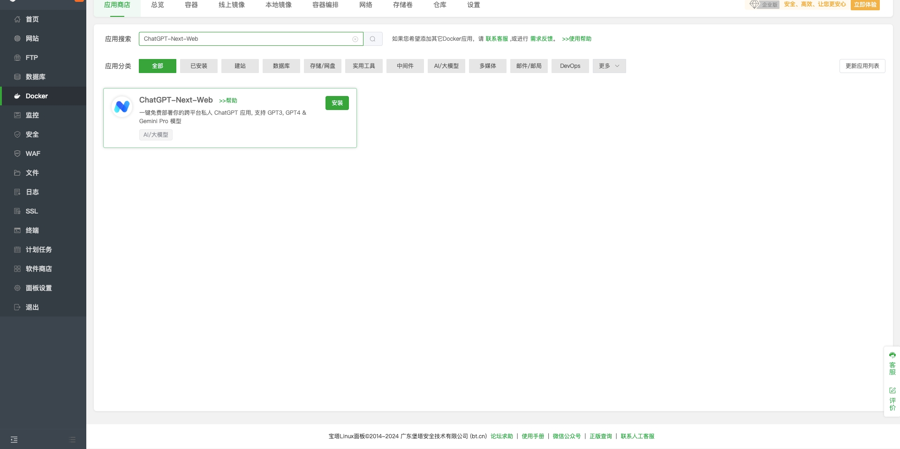
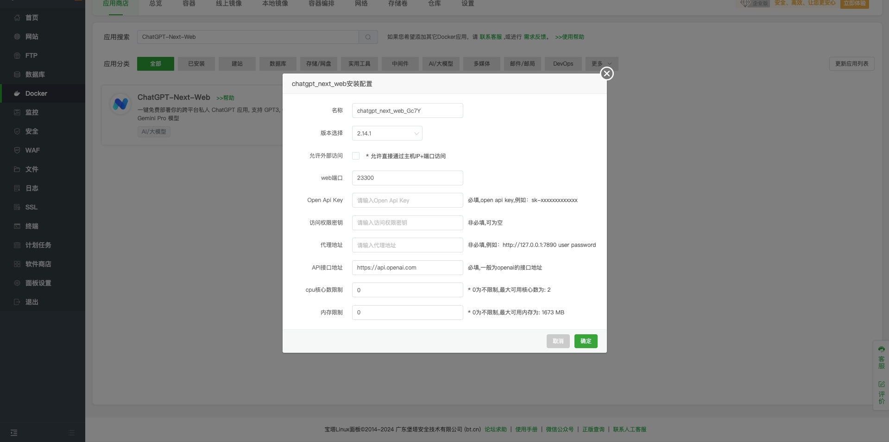
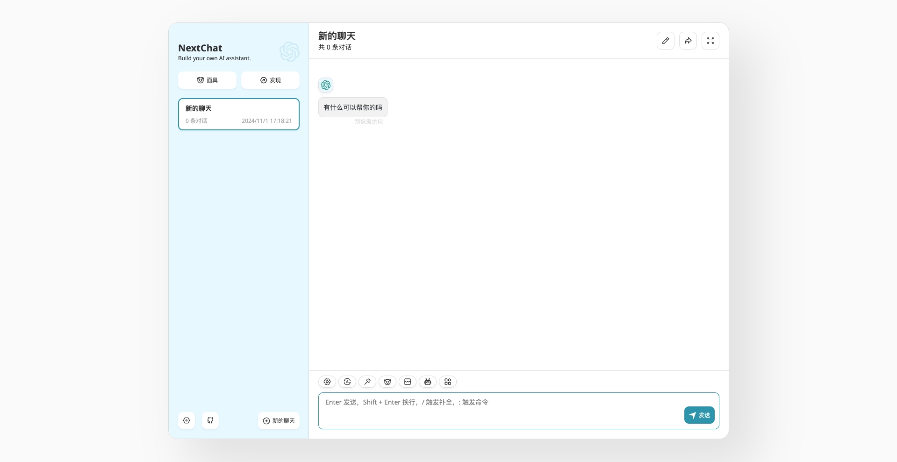
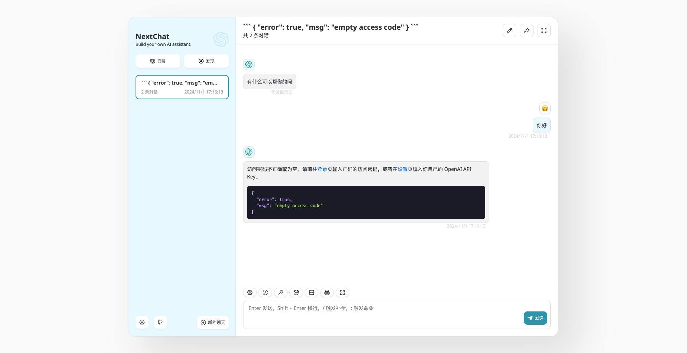
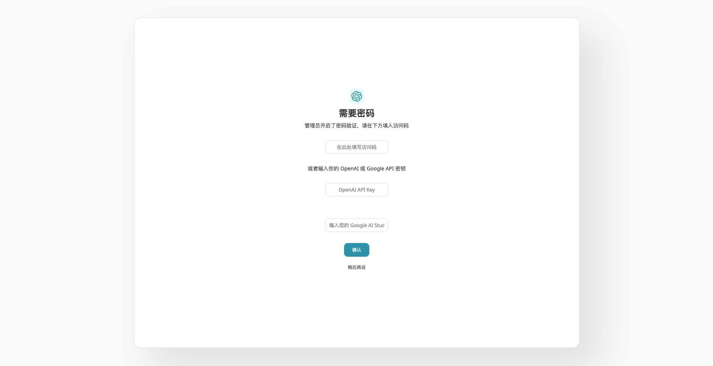
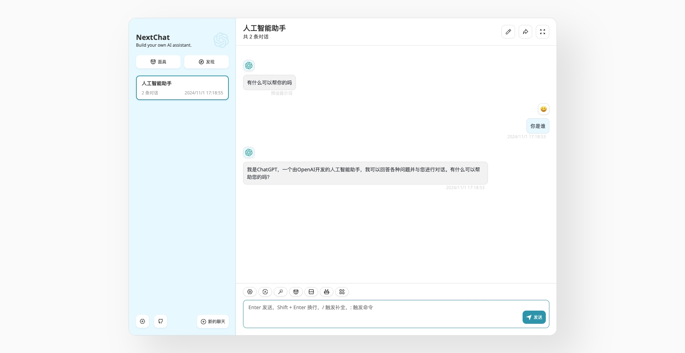

# 宝塔面板 的部署说明

## 拥有自己的宝塔
当你需要通过 宝塔面板 部署本项目之前，需要在服务器上先安装好 宝塔面板工具。 接下来的 部署流程 都建立在已有宝塔面板的前提下。宝塔安装请参考 ([宝塔官网](https://www.bt.cn/new/download.html))

> 注意：本项目需要宝塔面板版本 9.2.0 及以上

## 一键安装

1. 在 宝塔面板 -> Docker -> 应用商店 页面，搜索 ChatGPT-Next-Web 找到本项目的docker应用；
2. 点击 安装 开始部署本项目

1. 在项目配置页，根据要求开始配置环境变量；
2. 如勾选 允许外部访问 配置，请注意为配置的 web端口 开放安全组端口访问权限；
3. 请确保你添加了正确的 Open Api Key，否则无法使用；当配置 OpenAI官方 提供的key(国内无法访问)，请配置代理地址；
4. 建议配置 访问权限密码，否则部署后所有人均可使用已配置的 Open Api Key(当允许外部访问时)；
5. 点击 确认 开始自动部署。

## 如何访问

通过根据 服务器IP地址 和配置的 web端口 http://$(host):$(port)，在浏览器中打开 ChatGPT-Next-Web。

若配置了 访问权限密码，访问大模型前需要登录，请点击 登录，获取访问权限。

