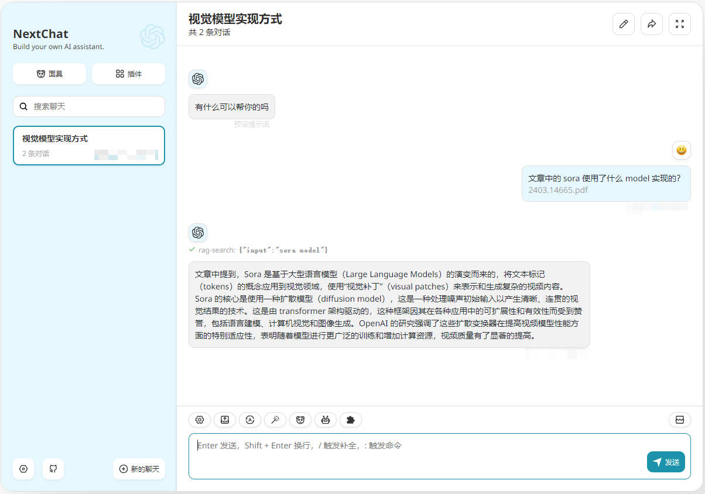

# RAG 功能配置说明

> [!WARNING]
> 该功能目前在预览阶段，可能会有较多的问题，请在仔细阅读本文档后再使用。

## 效果图

## 原理

## 已知问题

- 由于接口中使用 nodejs 运行时，在 vercel 环境下接口可能会超时，建议使用 docker 部署
- 已开启的插件可能会影响到数据检索，可以关闭部分插件后再使用
- 已创建的向量数据不会删除
- 同一聊天窗口内即使“清除聊天”也可以访问已经上传的文件内容
- RAG 插件需要一定的话术来让模型触发查询
- 上传文件部分的 UI 交互可能会变更
- 暂不支持文档总结

## 支持的文件类型

- txt
- md
- pdf
- docx
- csv
- json
- srt
- mp3 (基于OpenAIWhisper)

## 配置

1. 登录 https://cloud.qdrant.io 并创建一个账户
2. 在控制面板中创建一个 Cluster
3. 获取 Cluster 的 Cluster URL 和 API Key
4. 完善下面的环境变量配置后即可使用

## 环境变量

### `ENABLE_RAG`

如果你想启用 RAG 功能，将此环境变量设置为 1 即可。

### `QDRANT_URL`

qdrant 服务的 Cluster URL。

### `QDRANT_API_KEY`

qdrant 服务的 ApiKey。

### `RAG_CHUNK_SIZE` （可选）

分割后文档的最大大小（按字符数计算），默认：2000。

### `RAG_CHUNK_OVERLAP` （可选）

分割文档时块重叠数量，默认：200。

### `RAG_RETURN_COUNT` （可选）

检索时返回的文档数量，默认：4。

### `RAG_EMBEDDING_MODEL` （可选）

向量化时使用的向量模型，默认：text-embedding-3-large。
可选项：
- text-embedding-3-small
- text-embedding-3-large
- text-embedding-ada-002