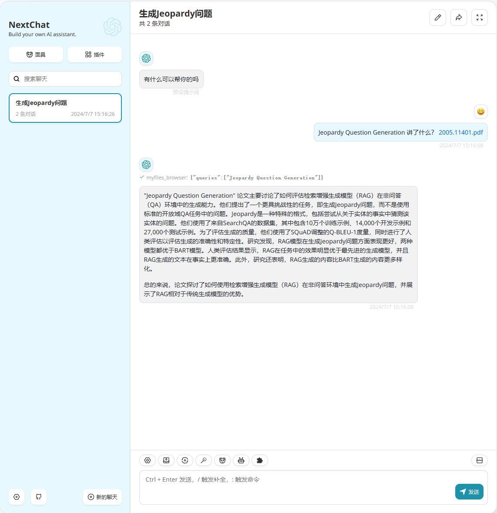
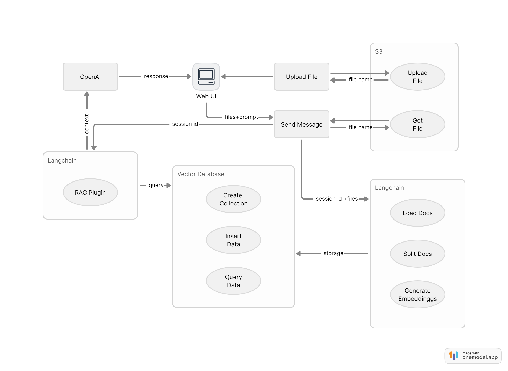

# RAG 功能配置说明

> [!WARNING]
> 新版本将向量库从 qdrant  变更为 supabase，请注意相关参数变更！

## 效果图



## 原理

以下为早期实现原理，部分逻辑与最新版本存在差异，仅供参考



## 使用须知

- 由于接口中使用 nodejs 运行时，在 vercel 环境下接口可能会超时，建议使用 docker 部署
- 由于其他插件会影响到模型对 RAG 检索插件的调用，所以目前的做法是上传文件后默认只保留 RAG 插件的开启，其他插件将被禁用
- 已创建的向量数据不会删除
- 同一聊天窗口内即使“清除聊天”也可以访问已经上传的文件内容

## 支持的文件类型

- txt
- md
- pdf
- docx
- csv
- json
- srt
- mp3 (基于OpenAIWhisper)

## 配置

1. 登录 https://supabase.com 并创建一个账户
2. 在控制面板中创建一个项目
3. 在 `Project Settings` `API Settings` 中获取 `URL` 和 `service_role secret`
4. 在 `SQL Editor` 中执行下面脚本创建表和函数(需根据[模型维度参考]修改vector(1536)中的维度数据)

```sql
-- Enable the pgvector extension to work with embedding vectors
create extension vector;

-- Create a table to store your documents
create table documents (
  id bigserial primary key,
  content text, -- corresponds to Document.pageContent
  metadata jsonb, -- corresponds to Document.metadata
  embedding vector(1536) -- 1536 works for OpenAI embeddings, change if needed
);

-- Create a function to search for documents
create function match_documents (
  query_embedding vector(1536),
  match_count int DEFAULT null,
  filter jsonb DEFAULT '{}'
) returns table (
  id bigint,
  content text,
  metadata jsonb,
  embedding jsonb,
  similarity float
)
language plpgsql
as $$
#variable_conflict use_column
begin
  return query
  select
    id,
    content,
    metadata,
    (embedding::text)::jsonb as embedding,
    1 - (documents.embedding <=> query_embedding) as similarity
  from documents
  where metadata @> filter
  order by documents.embedding <=> query_embedding
  limit match_count;
end;
$$;
```

5. 完善下面的环境变量配置后即可使用

## 环境变量

### `ENABLE_RAG`

如果你想启用 RAG 功能，将此环境变量设置为 1 即可。

### `SUPABASE_URL`

supabase 项目 url。

### `SUPABASE_PRIVATE_KEY`

supabase 项目 service_role secret。

### `RAG_CHUNK_SIZE` （可选）

分割后文档的最大大小（按字符数计算），默认：2000。

### `RAG_CHUNK_OVERLAP` （可选）

分割文档时块重叠数量，默认：200。

### `RAG_RETURN_COUNT` （可选）

检索时返回的文档数量，默认：4。

### `RAG_EMBEDDING_MODEL` （可选）

向量化时使用的向量模型，默认：text-embedding-3-large。
可选项：

- text-embedding-3-small
- text-embedding-3-large
- text-embedding-ada-002

### `OLLAMA_BASE_URL` （可选）

新增支持 ollama embedding 模型支持。

此处配置为 ollama 服务地址，如：http://localhost:11434

配置后请修改参数 `RAG_EMBEDDING_MODEL` 为 ollama 的 embedding 模型名。

上面的数据库初始化语句中的 `vector(1536)` 也要修改为你的向量模型所使用的维度。

## 模型维度参考

| 嵌入模型名             | 维度 | 提供者 |
| ---------------------- | ---- | ------ |
| text-embedding-3-small | 1536 | openai |
| text-embedding-3-large | 3072 | openai |
| text-embedding-ada-002 | 1536 | openai |
| snowflake-arctic-embed | 1024 | ollama |
| mxbai-embed-large      | 1024 | ollama |
| nomic-embed-text       | 768  | ollama |
