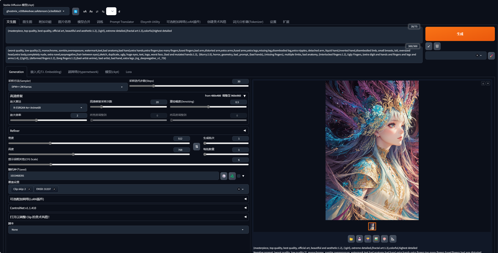
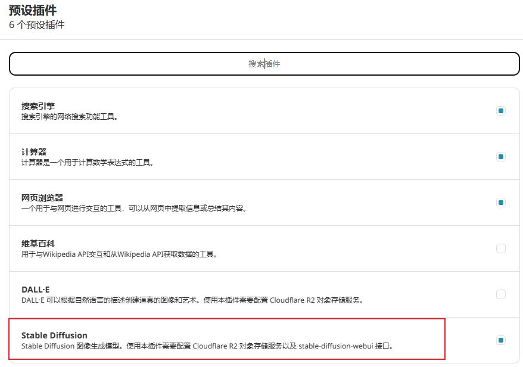
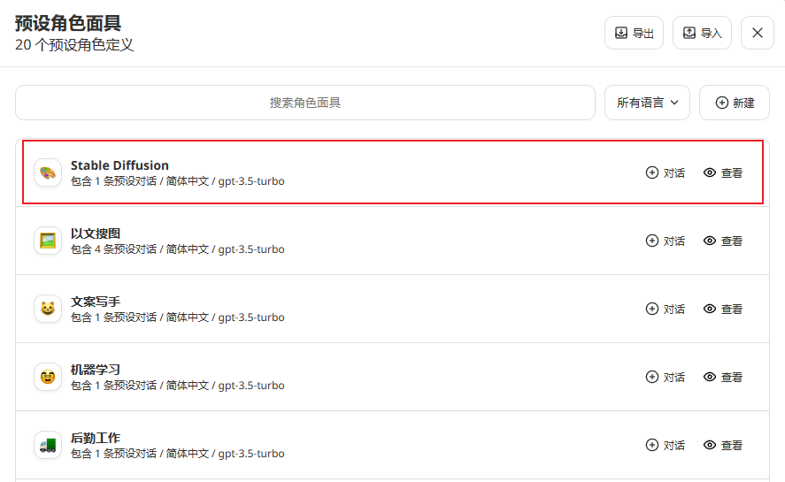
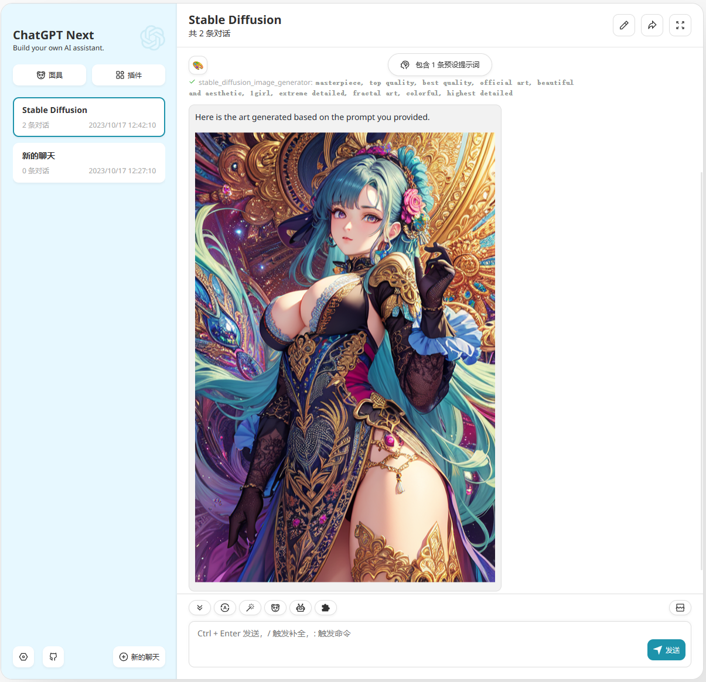

# Stable Diffusion 插件配置指南

## 前置条件

1. 部署 [stable-diffusion-webui](https://github.com/AUTOMATIC1111/stable-diffusion-webui) 项目，并保证可以正常使用 （必须）

2. 在 [Civitai](https://civitai.com/) 挑选喜欢的底座模型 （可选）

3. 生成一张图片并记住相关的参数配置 （可选）

   

## 环境变量

- `STABLE_DIFFUSION_API_URL`（必填）

  stable-diffusion-webui 服务的 api 地址，示例：http://127.0.0.1:7860

- `STABLE_DIFFUSION_NEGATIVE_PROMPT`（可选）

  反向提示词(Negative Prompt)，默认值：`longbody, lowres, bad anatomy, bad hands, missing fingers, extra digit, fewer digits, cropped, worst quality, low quality`

- `STABLE_DIFFUSION_STEPS`（可选）

  采样迭代步数(Steps)，默认值：`20`

- `STABLE_DIFFUSION_CFG_SCALE`（可选）

  提示词相关性(CFG Scale)，默认值：`7`

- `STABLE_DIFFUSION_WIDTH`（可选）

  生成图像宽度，默认值：`720`

- `STABLE_DIFFUSION_HEIGHT`（可选）

  生成图像高度，默认值：`720`

- `STABLE_DIFFUSION_SAMPLER_INDEX`（可选）

  采样方法(Sampler)，默认值：`Euler a`

## 如何使用

由于 OpenAI 的函数描述输入字符数量有限，在描述中并不能很好的将 Stable Diffusion 的提示词规则告诉 GPT。

所以这里提供了一个 Stable Diffusion 面具用来间接告诉 GPT 该如何调用 Stable Diffusion 插件，详细的内容请查看该面具的提示内容，当前您也可以自行修改。

这里需要注意，R2 存储在中国网络环境下可能无法正常使用，请确保你的网络可以正常访问 R2 存储服务，否则将无法正常使用本插件。

1. 首先第一步根据上面的章节配置好插件的变量

2. 在插件中开启 StableDiffusion 插件

   

3. 在面具中找到 StableDiffusion 面具并进行对话

   

4. 使用愉快

## 示例



模型：[GhostMix - v2.0-BakedVAE | Stable Diffusion Checkpoint | Civitai](https://civitai.com/models/36520/ghostmix)

环境变量：

```
STABLE_DIFFUSION_API_URL=http://127.0.0.1:7860
STABLE_DIFFUSION_WIDTH=512
STABLE_DIFFUSION_HEIGHT=768
STABLE_DIFFUSION_NEGATIVE_PROMPT=(worst quality, low quality:2), monochrome, zombie,overexposure, watermark,text,bad anatomy,bad hand,extra hands,extra fingers,too many fingers,fused fingers,bad arm,distorted arm,extra arms,fused arms,extra legs,missing leg,disembodied leg,extra nipples, detached arm, liquid hand,inverted hand,disembodied limb, small breasts, loli, oversized head,extra body,completely nude, extra navel,easynegative,(hair between eyes),sketch, duplicate, ugly, huge eyes, text, logo, worst face, (bad and mutated hands:1.3),  (blurry:2.0), horror, geometry, bad_prompt, (bad hands), (missing fingers), multiple limbs, bad anatomy, (interlocked fingers:1.2), Ugly Fingers, (extra digit and hands and fingers and legs and arms:1.4), ((2girl)), (deformed fingers:1.2), (long fingers:1.2),(bad-artist-anime), bad-artist, bad hand, extra legs ,(ng_deepnegative_v1_75t)
STABLE_DIFFUSION_STEPS=30
STABLE_DIFFUSION_CFG_SCALE=6
```

