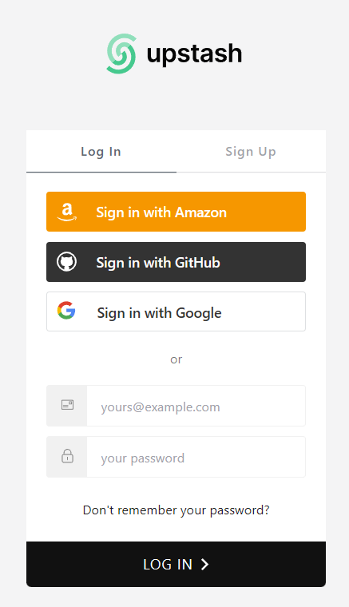
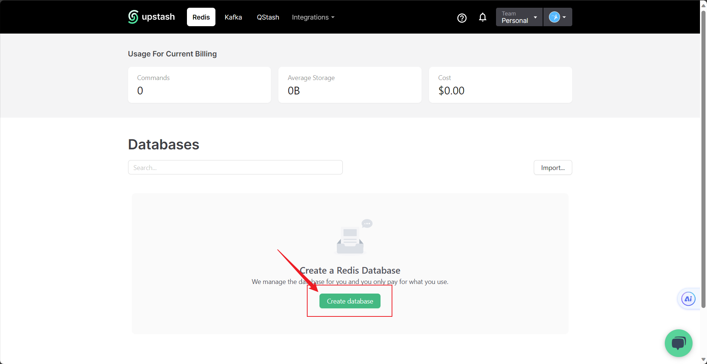
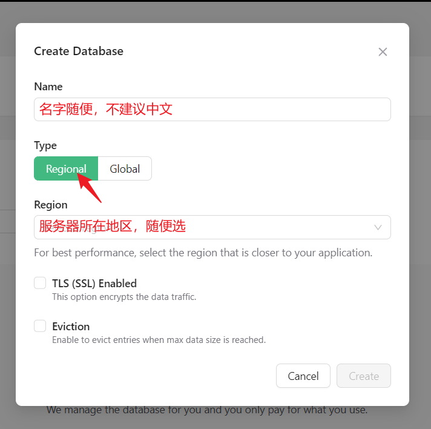
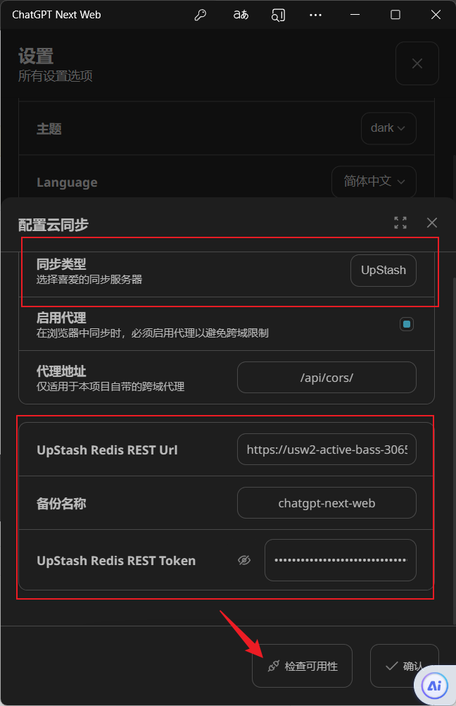
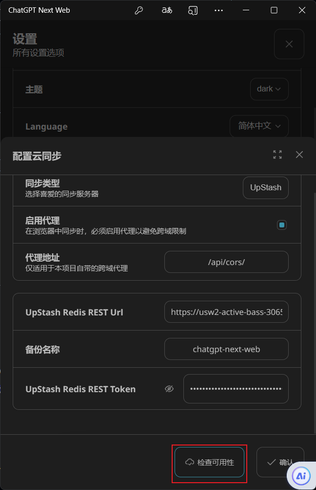
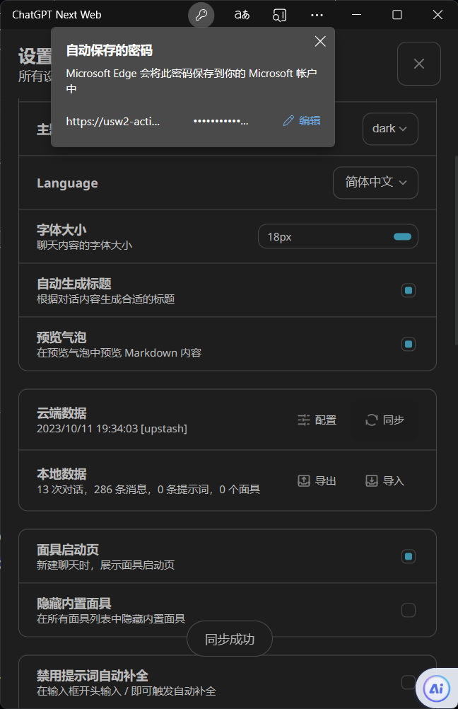

# 同步聊天记录（upStash）
## 准备工作
- GitHub账号
- 拥有自己搭建过的ChatGPT-Next-Web的服务器
- [UpStash](https://upstash.com)

## 开始教程
1. 注册UpStash账号
2. 创建数据库

    

    

    

3. 找到REST API，分别复制UPSTASH_REDIS_REST_URL和UPSTASH_REDIS_REST_TOKEN（⚠切记⚠：不要泄露Token!）

   

4. UPSTASH_REDIS_REST_URL和UPSTASH_REDIS_REST_TOKEN复制到你的同步配置，点击**检查可用性**

    

    如果没什么问题，那就成功了

    

5. Success! 

   
