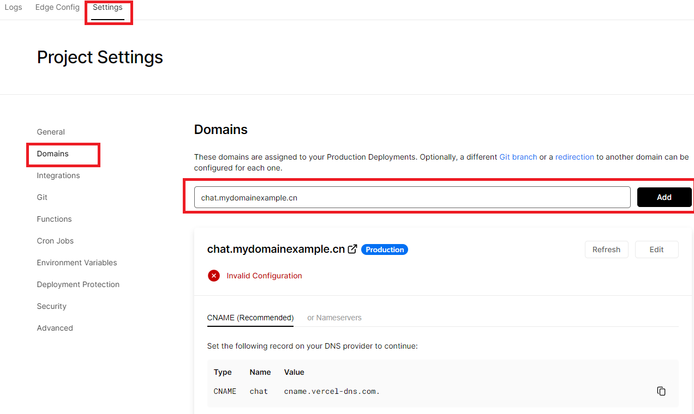
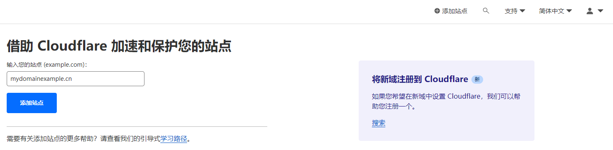
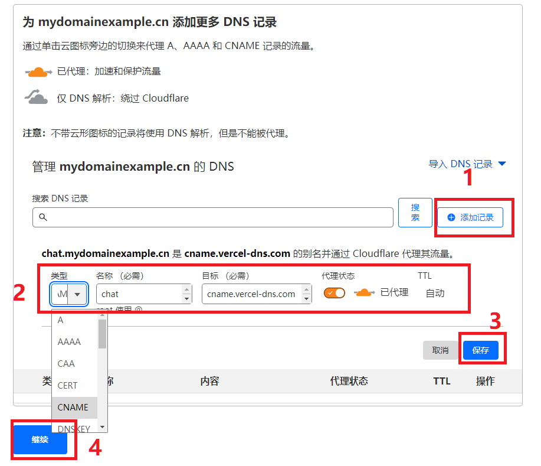
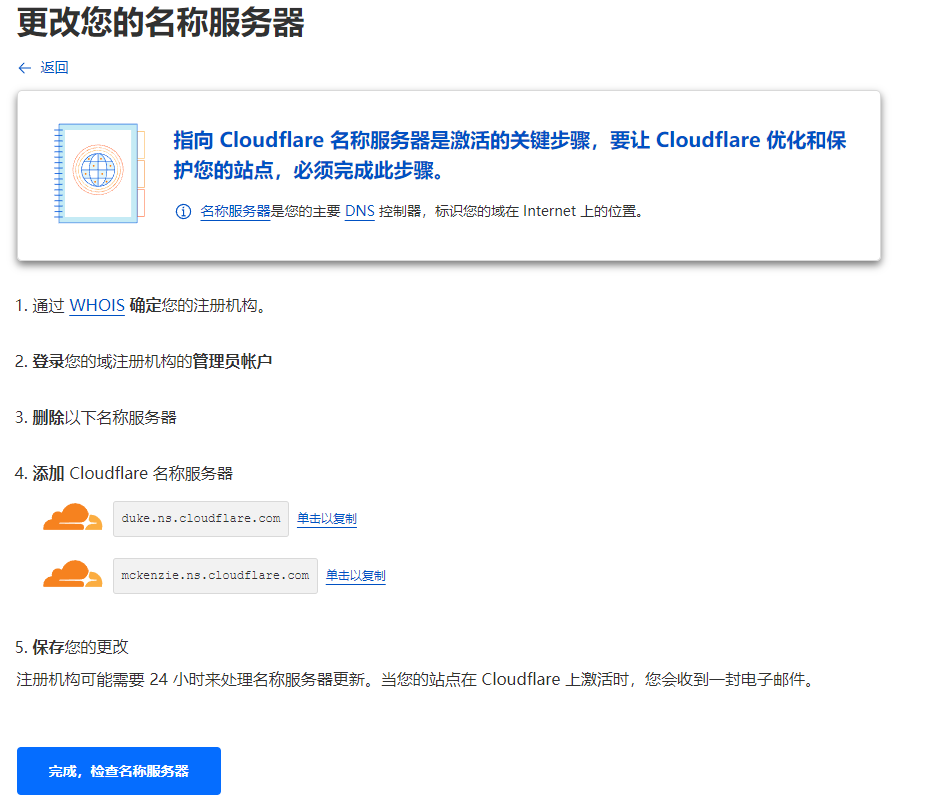

# Vercel 部署教程
使用 Vercel 可以无需服务器一键部署本项目。

本教程将涵盖以下内容：
- 基础知识介绍： Vercel ， Cloudflare （简称CF）等；
- 如何一键在 Vercel 部署本项目；
- 如何用 Cloudflare 的 CDN 服务（使被墙的网站可以在中国直接访问）。

## 基础知识介绍
- Vercel 是可以免费部署 web 应用的云平台。本项目支持 Vercel 一键部署，免费且无需服务器，无需懂 linux 和 node 开发，Github 源码更新后自动更新部署。缺陷是，Vercel 网络在国内被墙，需要使用 Cloudflare CDN 或类似服务免墙访问。
- Cloudflare 是提供域名托管与解析，CDN 代理，web 应用部署的平台。其免费提供大多数服务。
- 域名：域名由 DNS 服务器解析成 ip 地址后，客户端才能访问。域名的解析和管理由许多“DNS 记录”组成：
  - A 记录：将一个域名解析到IP地址。例如：abc.example.com 解析到 76.76.21.21
  - CNAME 记录：将域名解析到另一个域名，最终地址取决于目的域名。例如：abc.example.com 解析到 cname.vercel-dns.com
  - NS 记录：指示域名的解析由什么服务器负责。例如：将 example.com 顶级域名 NS 记录修改为 Cloudflare NS 服务器后，你的域名即在 CF 托管，由 CF 负责解析。
- SSL 证书起到两个作用：加密客户端和服务器之间的通信；证明服务器端是真正的域名拥有者（而不是劫持者伪造的网站）。你需要证明你拥有域名，或者域名能正确解析到你的服务器，证书机构（CA）才会给你颁发 SSL 证书。Vercel 和 Cloudflare CDN 会自动为你的网站加上证书。

## 如何在 Vercel 部署本项目
本节将说明以下部署步骤：
1. Github 上 fork 本项目；
2. Vercel 部署项目；
3. 添加自有域名。
4. 使用 Cloudflare 的 CDN 服务

本节也包含以下额外的步骤和说明：
- 如何更改环境变量
- 如何重新部署

以下将详细介绍每个步骤。

### Github 上 fork 本项目
1. 注册 Github 账户并登录。
2. 到[本项目 repo 页面](https://github.com/Yidadaa/ChatGPT-Next-Web)，点击右上角的 Fork 按钮，即可在你的 Github 账户中，创建一个本项目的 fork（分支/副本/复刻）。
    
    
    相关知识点：
    - 你可以修改你的 fork 后用于部署。
    - 本项目 repo 更新后，fork 会自动更新，并且合并你的修改。
    - 项目部署 Vercel 后，fork 一旦更新，Vercel 会自动重新部署更新后的网站。
    
### Vercel 部署项目
1. 注册 [Vercel](https://vercel.com) 账户（需要提供任意手机号码验证）。
2. 在 Vercel 创建一个全新的项目，按照下列步骤进行：
   1. 进入 Vercel 控制台首页；
   2. 点击 Add New，选择 Project。
        
   4. 在 Import Git Repository 处，搜索 chatgpt-next-web；选中新 fork 的项目，点击 Import。
        
   6. 在项目配置页，点开 Environmane Variables 开始配置环境变量；依次新增名为 OPENAI_API_KEY 和 CODE 的环境变量，填入环境变量对应的值；点击 Add 确认增加环境变量；请确保你添加了 OPENAI_API_KEY，否则无法使用；点击 Deploy，创建完成。
        
   7. 耐心等待 5 分钟左右部署完成。此时，你可以使用 Vercel 提供的子域名访问你的网站 （国内需要梯子）。 
3. 添加自有域名（可选）：
   1. 到 Vercel 项目，依次点击左上角 Settings - 左侧 Domains；在右侧输入你的域名，点击 Add 添加。
        
   2. 根据 Vercel 的提示，到你的域名管理网站，添加对应的 CNAME 或 A 记录。
        ⚠️️ 注意：由于 Vercel 的网络在国内被墙，直接解析可能导致你的域名被 GFW 进行 DNS 污染。为了回避这个问题，请按下一节提示，将域名放到 CF 托管后，添加记录并开启 CDN 代理。

### 使用 Cloudflare 的 CDN 服务
要使用 CF CDN 服务，请按照以下步骤：
1. 注册并登录 [Cloudflare](https://cloudflare.com)；
2. 点击右上角的“+添加站点”；
3. 输入你的域名，点击“添加站点”按钮；
    
4. 选择最下面的 Free 免费计划，点“继续”按钮；
5. CF 将扫描你已有的 DNS 记录，并复制过来。
    - 你可以在此处添加额外的 DNS 记录，例如：你想按 Vercel 的提示添加子域名，请按图示填写并添加 CNAME 记录，并保存。
    - 记得打开“代理”按钮（显示橙色云朵），即表示该域名访问会通过 CF CDN 代理，在国内可以避免被墙。
    - 操作完成后点击最下方“继续”按钮。
    
6. 你需要按 Cloudflare 的提示，到你的域名注册机构（例如：万网，腾讯云等域名供应商），修改域名的名称服务器（即添加 NS 记录）。更改生效后，域名解析将转到 CF 托管，CDN 也同时生效。
    
    
    
    当然，你也可以选择在 Cloudflare 注册新域名，或将已有域名转移过来。

### 如何更改环境变量

1. 进去 Vercel 项目内部控制台，点击顶部的 Settings 按钮；
2. 点击左侧的 Environment Variables；
3. 点击已有条目的右侧按钮；
4. 选择 Edit 进行编辑，然后保存即可。

⚠️️ 注意：每次修改完环境变量，你都需要[重新部署项目](#如何重新部署)来让改动生效！

### 如何重新部署

1. 进入 Vercel 项目内部控制台，点击顶部的 Deployments 按钮；
2. 选择列表最顶部一条的右侧按钮；
3. 点击 Redeploy 即可重新部署。