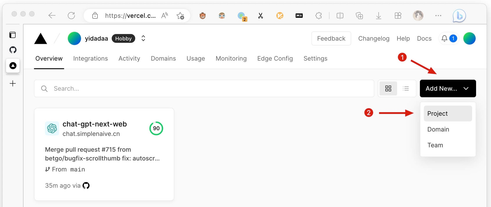
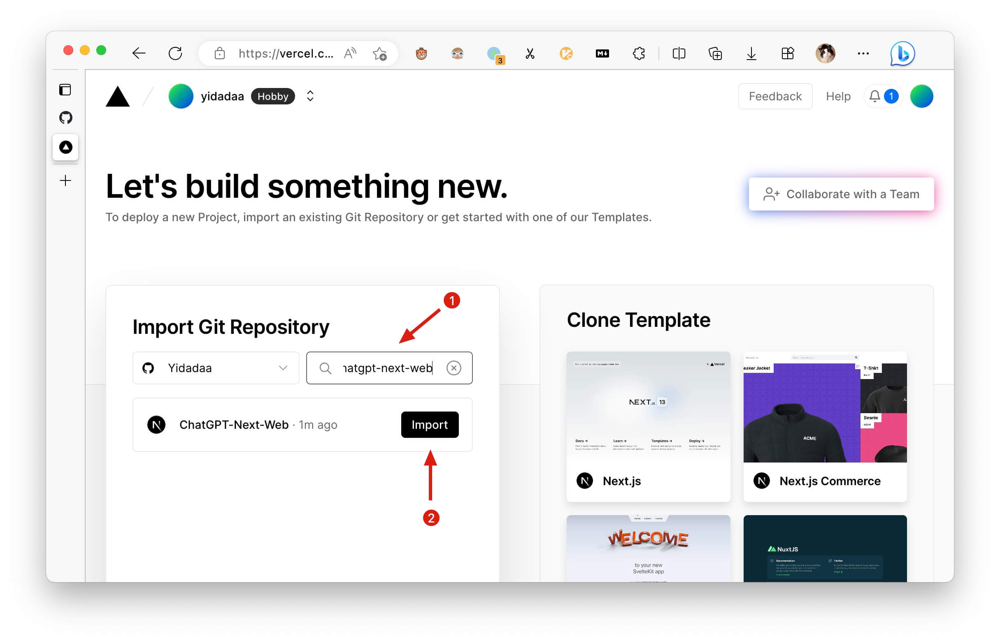
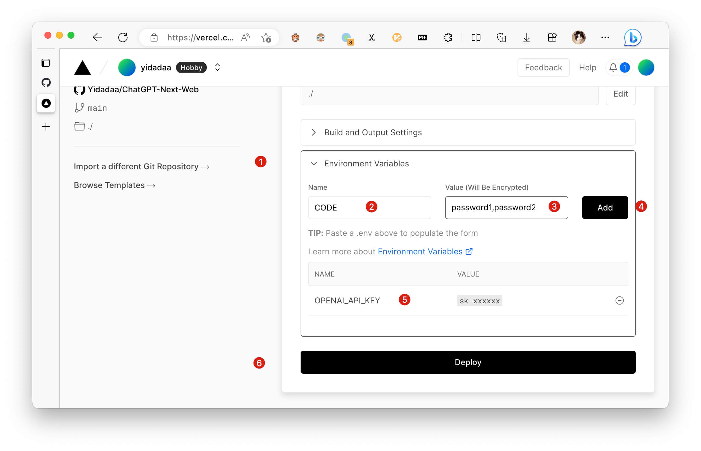
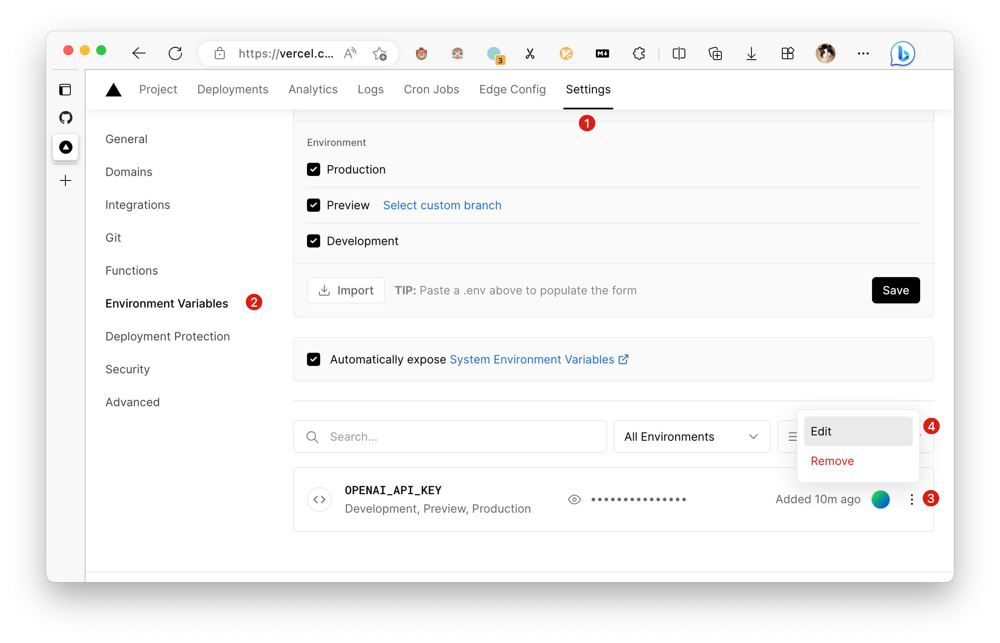
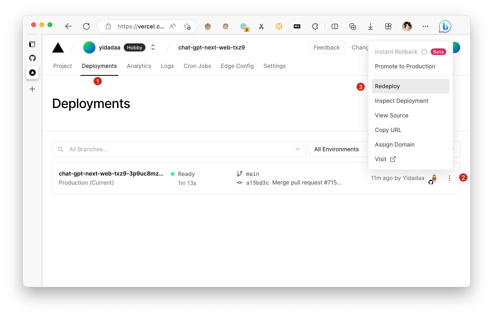

# Vercel 使用説明書

## 新規プロジェクトの作成方法

このプロジェクトを GitHub からフォークし、Vercel で新しい Vercel プロジェクトを作成して再デプロイする必要がある場合は、以下の手順に従ってください。

1.  Vercel コンソールのホームページにアクセスします;
2.  新規追加をクリックする;
3.  プロジェクトを選択します。

1.  Git リポジトリのインポートで、chatgpt-next-web を検索します;
2  .新しいフォークプロジェクトを選択し、インポートをクリックします。

1.  Project Settings ページで、Environment Variables をクリックして環境変数を設定する;
2.  OPENAI_API_KEY と CODE という名前の環境変数を追加します;
3.  環境変数に対応する値を入力します;
4.  Add をクリックして、環境変数の追加を確認する;
5.  OPENAI_API_KEY を必ず追加してください;
6.  Deploy をクリックして作成し、デプロイが完了するまで約 5 分間辛抱強く待つ。

## カスタムドメイン名の追加方法

\[TODO]

## 環境変数の変更方法

1.  内部 Vercel プロジェクトコンソールに移動し、上部の設定ボタンをクリックします;
2.  左側の Environment Variables をクリックします;
3.  既存のエントリーの右側のボタンをクリックします;
4.  編集を選択して編集し、保存する。

⚠️️ 注意: [プロジェクトの再デプロイ](#再実装の方法)環境変数を変更するたびに、変更を有効にするために必要です！

## 再実装の方法

1.  Vercelプロジェクトの内部コンソールに移動し、一番上のDeploymentsボタンをクリックします;
2.  リストの一番上の項目の右のボタンを選択します;
3.  再デプロイをクリックして再デプロイします。
